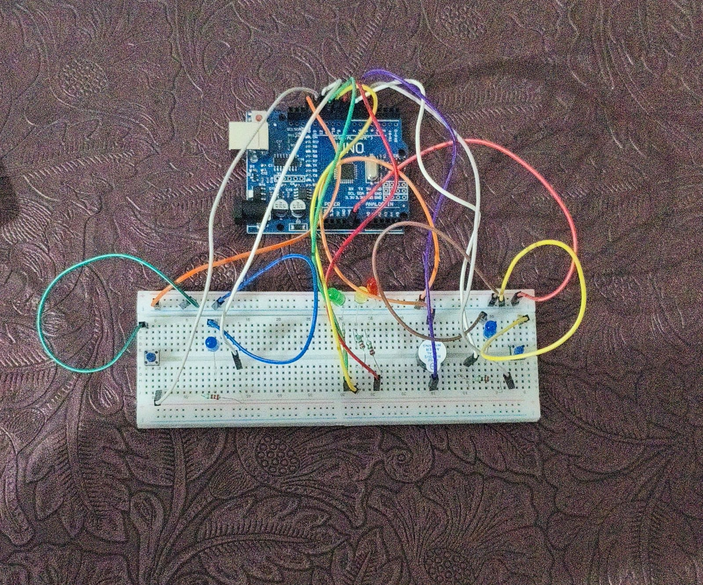

 🤖 Arduino Projects Collection

This repository contains a collection of Arduino projects that demonstrate my skills in electronics, sensors, embedded systems, and interactive hardware design.

## 📂 Projects Included

### 🎮 Two-Player Speed Reaction Game

A competitive Arduino-based reaction game for two players. Players must wait for the countdown sequence and react as quickly as possible when the signal appears. The first player to press their button wins the round.

#### Features

* Two-player gameplay
* Randomized reaction timing
* LED countdown indicators
* Buzzer feedback
* Automatic game reset

#### Components Used

* Arduino Uno
* LEDs
* Push Buttons
* Piezo Buzzer
* Breadboard and Jumper Wires

---

### 📡 Arduino Radar Object Detection System

An Arduino-based radar system that uses an ultrasonic sensor mounted on a servo motor to scan its surroundings and detect nearby objects.

#### Features

* 180° scanning motion
* Real-time distance measurement
* LED status indicators
* Audio alerts for nearby objects
* Continuous environmental monitoring

#### Components Used

* Arduino Uno
* HC-SR04 Ultrasonic Sensor
* SG90 Servo Motor
* RGB LED
* Piezo Buzzer
* Breadboard and Jumper Wires

---

## 🛠 Technologies Used

* Arduino IDE
* C/C++
* Embedded Systems Programming
* Sensor Interfacing
* Servo Motor Control
* Electronic Circuit Design

## 📷 Project Gallery

Add photos, circuit diagrams, and demonstration videos here.

### Speed Reaction Game

### Radar System

## 🚀 Future Projects

* IoT-based Monitoring Systems
* Smart Home Automation
* Robotics Projects
* PCB Design and Fabrication
* Wireless Sensor Networks

## 📖 Learning Outcomes

Through these projects, I gained hands-on experience in:

* Arduino Programming
* Hardware-Software Integration
* Sensor Data Processing
* Real-Time Control Systems
* Electronic Circuit Prototyping
* Problem Solving and Debugging

## License

This repository is open-source and intended for educational and learning purposes.

